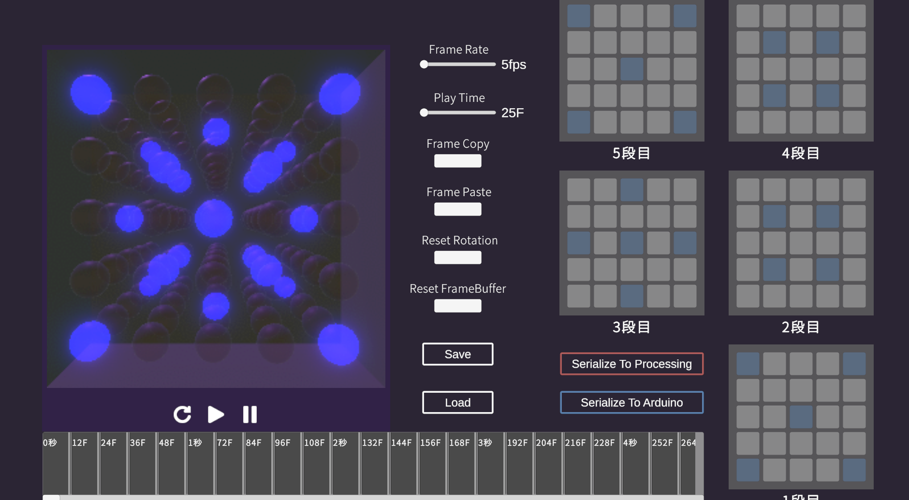
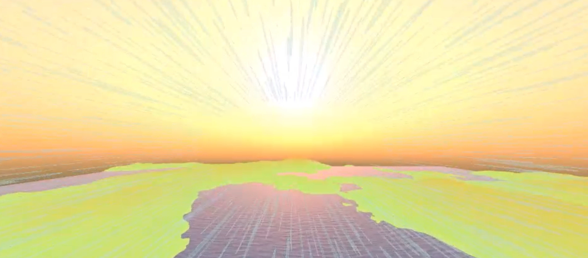

[![Qiita](https://img.shields.io/badge/--FFFFFF?style=social&logo=data:image/vnd.microsoft.icon;base64,iVBORw0KGgoAAAANSUhEUgAAAHgAAAB4CAMAAAAOusbgAAAAGXRFWHRTb2Z0d2FyZQBBZG9iZSBJbWFnZVJlYWR5ccllPAAAADNQTFRFgNRA9PvvquJ/1PC/YMkQddAwv+mfaswgyu2v6vjf3/TPldtgoN5witdQtOaPVcUA////rKcmfAAAABF0Uk5T/////////////////////wAlrZliAAAFI0lEQVR42tSb67qrKAyGw0FAQOn9X+3Udmk9JBAQZ57h7+7iFcjhI2TD6z8a8P8BCzVLAJ22YWGSzj8LHk2wiRgQnXgG7CIJ3eDz2Bvso06sMcyiI9gMqWIE3wcspE6VA9R9cAOWhS6BTRP2gx5vgP2QbowoGsEipnvDqibwveWWFk2D59RjDL4SLKbUZ2hTBR6H1G3ECrDXqeOYBBfsunLfBy14YJN6D4QM/wYXI1/BLqV/gwz97Sooh/jEUACPd7mwRIwR+54sWLD9V8NnnL5Tz995sGlkDsyKV0Pci0rv4oYJ60kC9neOBjPi82QQpxRm+eLhl4xQsB4psC/urxxppTLvp8XPnwCXDtgavmrGZ5A4OBZWW6HXAzGJx8CXjQbgS6jTkJSzYeAB+Tol/+DzYV4lp79fDyBVBfg3D5AhenN4NU92ryNUOAeZybHBWpzBQrPy98tYjt2R4M2+gPzpgGEVeW8bFA+cxiNYXGO0qNS7kZdawxEsCxGOo3d3qU+l0pJXsC6mE0bC3NlgSIVTBnprbH2i3kVjOt18DRvoNJbGeoHw2+1M/DU/sKd/sM5jeWl6Ynzp8APHnP3lon4mNGUs229g/ONsy0VqPWaXOea4gl3e11Evz262e0fVkdZvdgXHQlzNOQdiGlEnHVwufvk/sE154xorL4hhjT2WNgSg57VMhXAZqmhf8AWbwoJflVo7KCUlmNySv+BQOOGGS80AUeWWrD5gS9m8WgSGUdXFgV2G1FS8foMF6UujnMDWL3cvJiXlc0ClsJ8OEA07HaQSOYcYFvDcHPpoJbzcqTLp5/2PQO3GJ2pFSE3jc6XKBlsPRPz/OrGRTqmG+t5ONRF7rShwYAk3hlkTez0DYfG/cBn1PTC+YfINziUmB8kOt7aaCD8keN3lt1KXTcZVOOSJAMP63NNUTT3KRPSogADvVY+qr/uU78oUeF8oqY9cx4tUbAW/asO1FuULHAVWL3aloFRXws2aBfa3FozbCAv8qovY58seCg4scJVdXy70igogtgh+Ta2ulAVDGcwvcSKlMBTsAF/OuZLDJKOPPYpKi5JhIC/BMDCi8oeCBeB+JpEHsEJ6vNaccn68SB/PA+cedDVa081ELvjo6kKd9dAmMFwL5nH21XXN+AFD+QVhf2ROrsMoxahrDqjxAxGL+3WaCFzgAHH6qhvY4UoBiG+S3cABD29AJIF+PUAaj29AqX3x4E4vkwMlBE0nsCTqM0BZ/PQg2GzguVRQ7AsWG/hBux6JlA2kzWvx1JLVDuwfdOUJDcdA67leSz6LCHMAq/ScYR/J9vQKAxwd0kqWEKR6jznoNUBATqD02uz9N8yXlzZIVWm5X1/myFPJDzSExq5kM7HB+HtHI9mUtAQUr0ggGsOVFeyevVh6P+OaLpRNEzgXlcrguUn/3GYB6xnPVoQStzOVYeQ2C5KVWuChxeldWztusyBd77DFbl7hwnXHqD5FKCWxQ9agu5jF1sZw+WDFAxduwnaS6kgflw7zbEUKDKtnj3MH/2ttAmCWZTQwOtgq6g7NpS+iWbA/2TDbI3uTeWdc/3xaOmBX03sru3GJUE/eCnt1owI3gPz8E54xZ0ZHuXxqm0vgl7+5aMlOi1cFc+OkwbOFAKrFW3fZscUeZWQtPl1uaOQUWcba/xwyMOoYwBQWFUE0sGpk7LKSj6xXoFw1tQ28sOe8e9lg+Bq8tpD268g8+U40ddWapgqef6sdOX0lSFiKuA2XjX8EGAA+EkbvnTUZgQAAAABJRU5ErkJggg==&label=Follow%20YukitakaShima)](https://qiita.com/yukitakaGrid)

# Index
1. [Profile](#anchor2)
2. [Works](#anchor1)
3. [Hisotory](#anchor3)

---

# Profile

### Who is
#### 志摩 幸隆 / Yukitaka Shima
- *芝浦工業大学システム理工学部電子情報システム学科* (2020.4~現在)
- デジタルアート制作サークル *ShibaLab* (2022.4~2023.5)
- *チームラボ Interactive Team* サマーインターン (2023.9)

### SkillSet
Unity/C#、Shader/GPU、C++、Python、Processing、TypeScript、AfterEffects
  
### Interested in
- **コンピューターグラフィックス/GPU**
- **物理シミュレーション**
- **画像処理**
- **最適化**
- **インターフェース**

---

# Works

### リアルタイムLEDCUBEアニメーション制御ソフト

サークルで制作。作品「**LEDCUBE**」のアニメーションをアルゴリズムでリアルタイムに生成するシステム。

https://github.com/yukitakaGrid/LightAnimationController

### LightEffects 

サークルで制作。作品「**LEDCUBE**」のアニメーションを楽に多く、みんなで作るために開発されたデスクトップアプリケーション。

BOOTH : https://ariake12.booth.pm/items/4796978

### Tree of the life

PCD2023展示へ向けた制作物。Processingを使い、魂の軌跡と木の成長をプロシージャルに生成。

https://github.com/yukitakaGrid/Tree_of_Souls

### わりかんじ

ハッカソンで開発した飲み会の割り勘用のwebアプリケーション。フロントエンドを担当。

https://github.com/geekcamp2023-vol5-team31/frontend

### KitAI

ハッカソンで開発したGPTによりリアルタイムにコマンドを実装するDiscord bot

https://github.com/yukitakaGrid/KitAI

### 鳥プランク

ハッカソンで制作。mocopiとMeta Quest2を利用した筋トレしながら空を飛ぶゲームのプロシージャルな地形生成Shaderの開発。

### Nebula

オンラインデモパーティにて制作したデモシーン。雲と星のアニメーションをフラグメントシェーダー単体で表現。

https://www.shadertoy.com/view/dsGBDh

その他
- 映像ディスプレイが踊るインタラクティブアート
- 教育向け動物出現ARアプリ
- 子ども支援おまもりIoTシステム
- 蝶のインタラクティブアート

---

# History

2022.6 技育CAMP マンスリーハッカソン vol.5  
2022.10-11 シンクトワイス株式会社 TECH-BASE IoTエンジニアコースインターン  
2022.10-12 株式会社TREE Digital Studio REALIZE事業部 Unityエンジニアインターン   
2023.6 PCD2023展示  
2023.7 技育CAMP マンスリーハッカソン vol.6  
2023.8 技育CAMP マンスリーハッカソン vol.8  
2023.8-9 ファンクリエイト第一期  
2023.10 TDF 16ms#0 GLSL Graphics Compo  

