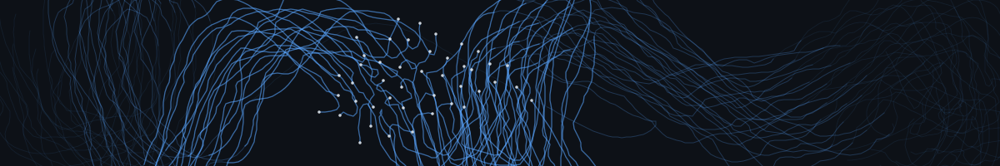
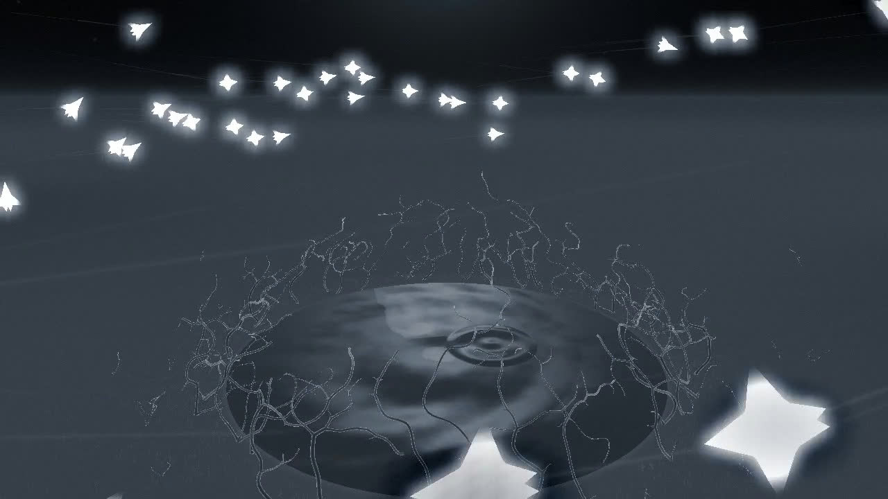
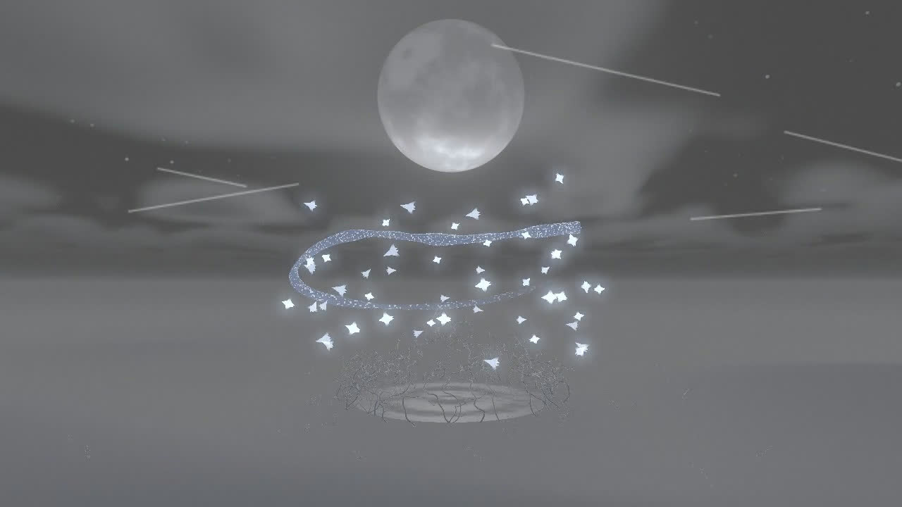
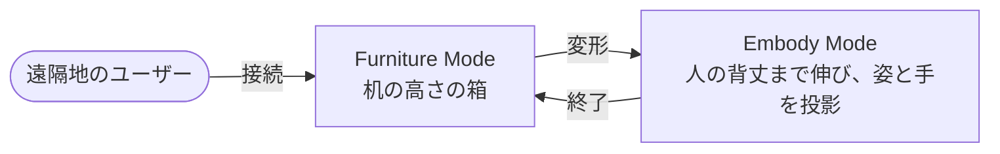
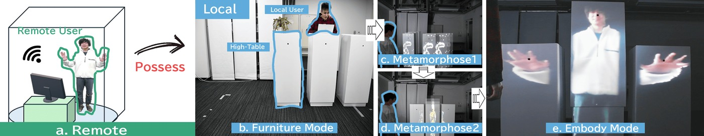

<picture>
  <source media="(prefers-color-scheme: dark)" srcset="assets/banner-dark.svg">
  <source media="(prefers-color-scheme: light)" srcset="assets/banner-light.svg">
  
</picture>

# yukitakaGrid

インタラクション、ジェネラティブアート、CG（シェーダー）を作っています。本業は土木技術者です。  
<sub>I build interactive and generative work and real-time graphics. Civil engineer by day.</sub>

<p>
  
  
  
  
  
  
  
  
  
</p>

## 作品

<table>
  <tr>
    <td width="50%"></td>
    <td width="50%"></td>
  </tr>
  <tr>
    <td align="center"><sub>ツキノカメ（静止画）</sub></td>
    <td align="center"><sub>ツキノカメ（静止画）</sub></td>
  </tr>
</table>

| 年 | 作品 | 内容 |
|---|---|---|
| 2026 | ツキノカメ（制作中） | Web インタラクション／VJ／映像。Boids による鳥の群れを、水・月・結晶などの場面で見せる。 |
| 2026 | [tiny-hide-and-seek](https://github.com/yukitakaGrid/tiny-hide-and-seek) | 3D スキャンした空間で遊ぶ、小人サイズのオンラインかくれんぼ。依存なしの Node.js WebSocket サーバーと Three.js クライアント（BVH 物理、PWA プッシュ、Redis 永続化）。 |
| 2025 | [MorphCubes](#morphcubes) | 遠隔地の人の身体性を表現する、複数の環境ロボット型テレプレゼンス。形状が変わる家具型ロボットを使う。 |
| 2023 | [Tree of Souls](https://github.com/yukitakaGrid/TreeOfSouls) | Boids とフラクタルによるジェネラティブアート（JavaScript、p5.js）。Processing Community Day Tokyo 2023 で展示。 |
| 2023 | [KitAI](https://github.com/yukitakaGrid/KitAI) | ハッカソンで制作した、ChatGPT がコマンドを実装する Discord bot（Python）。 |

### MorphCubes

> [!NOTE]
> 論文 *MorphCubes: Adaptive Modular Robots for Dynamic Remote Human Embodiment*（Shima & Takashima）が **ACM CHI '25 Late-Breaking Work** に採択され、**INTERACTION 2025 インタラクティブ発表賞（PC 推薦）** を受賞しました。


```mermaid
flowchart LR
    A([遠隔地のユーザー]) -- 接続 --> B[Furniture Mode<br>机の高さの箱]
    B -- 変形 --> C[Embody Mode<br>人の背丈まで伸び、姿と手を投影]
    C -- 終了 --> B
```


<sub>図1：Shima & Takashima, CHI EA '25, ACM</sub>

普段は家具として置かれたモジュールが、通話時に人の背丈まで変形し、遠隔地のユーザーの姿と手を映します。

## Boids

ツキノカメと Tree of Souls は、どちらも Boids（各個体が近傍の個体だけを参照して動くモデル）を使っています。Tree of Souls では、個体の軌跡からデジタル彫刻を生成しています。

```js
// 近傍の個体だけを参照して、次の速度を決める
for (const b of birds) {
  const near = birds.filter(o => o !== b && dist(o, b) < RADIUS);
  b.vel.add(separation(b, near).mult(0.05)); // 分離
  b.vel.add(alignment(b, near).mult(0.04));  // 整列
  b.vel.add(cohesion(b, near).mult(0.004));  // 結合
  b.pos.add(b.vel.limit(MAX_SPEED));
  b.trail.push(b.pos.copy());                // 軌跡を保存
}
```

## そのほかのリポジトリ

<table>
  <tr>
    <td width="50%" valign="top">
      <a href="https://github.com/yukitakaGrid/pcx_test">
        <picture>
          <source media="(prefers-color-scheme: dark)" srcset="https://github-readme-stats.vercel.app/api/pin/?username=yukitakaGrid&repo=pcx_test&theme=github_dark&hide_border=true">
          
        </picture>
      </a>
    </td>
    <td width="50%" valign="top">
      <a href="https://github.com/yukitakaGrid/Nebula">
        <picture>
          <source media="(prefers-color-scheme: dark)" srcset="https://github-readme-stats.vercel.app/api/pin/?username=yukitakaGrid&repo=Nebula&theme=github_dark&hide_border=true">
          
        </picture>
      </a>
    </td>
  </tr>
  <tr>
    <td width="50%" valign="top">
      <a href="https://github.com/yukitakaGrid/LightEffects">
        <picture>
          <source media="(prefers-color-scheme: dark)" srcset="https://github-readme-stats.vercel.app/api/pin/?username=yukitakaGrid&repo=LightEffects&theme=github_dark&hide_border=true">
          
        </picture>
      </a>
    </td>
    <td width="50%" valign="top">
      <a href="https://github.com/yukitakaGrid/LightAnimationController">
        <picture>
          <source media="(prefers-color-scheme: dark)" srcset="https://github-readme-stats.vercel.app/api/pin/?username=yukitakaGrid&repo=LightAnimationController&theme=github_dark&hide_border=true">
          
        </picture>
      </a>
    </td>
  </tr>
</table>

<details>
<summary><b>経歴・受賞</b></summary>

| 時期 | こと |
|---|---|
| 2025.11 | Generative VJ：BSP によるビル群のサイズ・高さの動的変容を用いた演出 |
| 2025.4〜 | 土木技術者 |
| 2025.3 | 芝浦工業大学 電子情報システム学科 卒業。卒業論文は MorphCubes |
| 2025.3 | INTERACTION 2025 インタラクティブ発表賞（PC 推薦） |
| 2025.2 | ACM CHI '25 Late-Breaking Work 採択 |
| 2023.10 | 16ms #0（GLSL Graphics Compo）：fBm ノイズによる星雲シミュレーションを提出 → [Nebula](https://github.com/yukitakaGrid/Nebula) |
| 2023.6 | Processing Community Day Tokyo 2023：Boids の軌跡によるデジタル彫刻 |

</details>

<details>
<summary><b>技術領域</b></summary>

HCI／メディアアート／CG（GPGPU・シェーダー）／VR・AR・MR／プロジェクションマッピング／自然シミュレーション／ジェネラティブデザイン

</details>

<details>
<summary><b>English (short)</b></summary>

Interactive and generative work. **Tsukinokame** (web / VJ / moving image, in progress), **MorphCubes** (modular shape-changing robots for remote human embodiment; CHI '25 Late-Breaking Work, INTERACTION 2025 Interactive Presentation Award), **Tree of Souls** (Boids and fractals; Processing Community Day Tokyo 2023). Civil engineer by day.

</details>

## GitHub 統計

<p>
  <picture>
    <source media="(prefers-color-scheme: dark)" srcset="https://github-profile-summary-cards.vercel.app/api/cards/profile-details?username=yukitakaGrid&theme=github_dark">
    
  </picture>
  <picture>
    <source media="(prefers-color-scheme: dark)" srcset="https://github-readme-stats.vercel.app/api/top-langs/?username=yukitakaGrid&layout=compact&count_private=true&theme=github_dark&hide_border=true">
    
  </picture>
</p>

